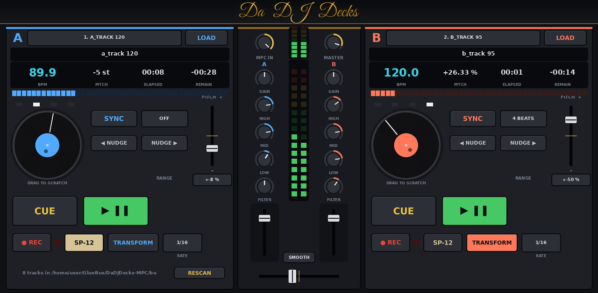

# Da DJ Decks for MPC

A two-deck DJ player for first-generation MPC OS devices (MPC X, Live / Live II, One, Key 61, Force; 32-bit ARM),
built as a native VST2 insert. It uses the same dependency-free build, packaging and skin pipeline as GlueBus, SP1200,
RadioReady EQ and Da Lufs Plug.



- **Tracks:** WAV files from `/sdcard/DJ` (16/24/32-bit, float, any rate). A loader thread reads and analyses them,
  so the audio thread never waits on the SD card.
- **Deck controls:** play/pause, cue, pitch ±8/16/50% (turntable style), and SYNC, which matches tempo, half or
  double time, and beat phase.
- **More per deck:** nudge, beat loops (1–16 beats), detected BPM and beat grid, and beat lights.
- **Scratch** (Q-Link or drag the platter), **transform** (beat-synced gate), and a crossfader that cuts in 1 ms.
- **REC** samples the MPC input into a deck (saved to `/sdcard/DJ/Samples`) so you can speed it up or slow it down.
  **SP-12 mode** adds 26.04 kHz / 12-bit drop-sample playback and recording, with pitch in semitones: the SP-1200
  45→33 trick.
- **Mixer:** gain, a 3-band isolator EQ with kills (Linkwitz-Riley 300 Hz / 4 kHz), a one-knob filter, channel
  faders, a crossfader (smooth/cut), master, and MPC input pass-through.
- **Display:** spinning platters, progress bars and meters on the MPC screen. Projects reopen with the same tracks
  loaded.

Install and usage: [mpc/INSTALL.md](mpc/INSTALL.md). Design notes: [docs/DESIGN.md](docs/DESIGN.md).

## Build
```
make test                  # native build + offline VST2 host test (writes test WAVs to build/native/djtest)
make arm                   # build/arm/dadjdecks.so (needs g++-arm-linux-gnueabihf), or: make docker
./scripts/package.sh       # dist/DaDJDecks-1.1.0-mpc-armv7.zip
./scripts/deploy.sh <ip>   # copy + install over SSH
python3 tools/make_skin.py docs   # regenerate the skin (+ preview, after make test)
```
