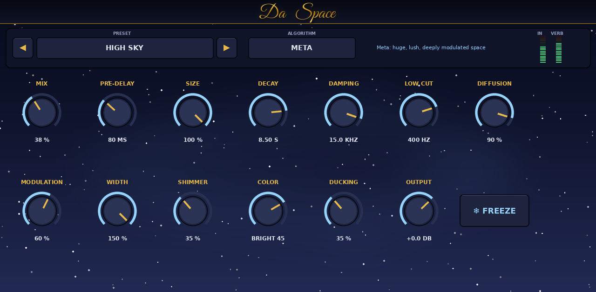

# Da Space for MPC

A spatial and reverb plugin for first-generation MPC OS devices (32-bit ARM), built as a native VST2 insert. It uses
the same dependency-free build, packaging and skin pipeline as the other GlueBus / RadioReady / Da plugins.



- **Seven algorithms:** Room, Hall, Plate, Classic (legacy), Ice, Meta and Reflex, all level-matched.
- **Controls:** pre-delay, size, decay (a true RT60, tested), damping, low cut, diffusion, modulation, width,
  octave shimmer, colour, ducking, freeze, mix and output.
- **34 presets**, including **High Sky**.

Install and usage: [mpc/INSTALL.md](mpc/INSTALL.md). Design notes: [docs/DESIGN.md](docs/DESIGN.md).

## Build
```
make test        # native build + offline host test (RT60, pre-delay, damping, shimmer, freeze, stability ...)
make arm         # build/arm/daspace.so
./scripts/package.sh
python3 tools/make_skin.py docs
```
