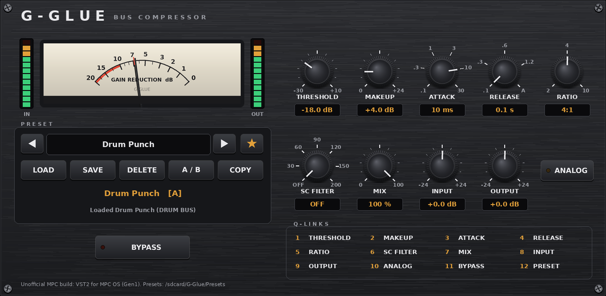

# G-Glue for MPC Standalone (unofficial VST2 build)

G-Glue running on first-generation MPC OS hardware (MPC X, Live / Live II, One, Key 61, Force), with no computer.

**Unofficial route.** Akai publishes no third-party plugin SDK for MPC Standalone
(see [../Documentation/MPC_STANDALONE_STATUS.md](../Documentation/MPC_STANDALONE_STATUS.md)). MPC OS loads Linux VST2
plugins that are registered in `MPC.settings`, which needs root SSH access. This build uses that route, like the
other plugins in this repository. It is not an Akai-native plugin format.

- **Same engine:** `src/gglue_mpc.cpp` is a thin VST2 wrapper around the shared G-Glue core (`../DSP`,
  `../Parameters`, `../Presets`), the same code as the desktop VST3 / VST2.
  - Same 11 parameters in Q-Link order, same 65 factory presets, same `.gglue` preset files.
  - Same project-state format, and the same unique ID (`GgBc`) as the desktop VST2.
- **MPC screen** (`tools/make_skin.py`, TUI.json):
  - analog GR needle meter: 12 square tiles of 72 px following one parameter; needle physics run in the plugin
  - IN / OUT LED meters and 72 px knobs with scales
  - preset browser: PRESET, ◀ ▶, LOAD, ★ favourites first, SAVE, two-tap DELETE
  - A/B with COPY, ANALOG, BYPASS, current preset and status lines
- **Binary:** 32-bit ARM hard-float (NEON); needs only libc / libm; highest glibc symbol 2.34 (MPC OS has 2.34).
  The C++ runtime is linked in and hidden, so the only exports are `VSTPluginMain`, `GG_ParamKey` and
  `GG_ParamCount`.

## Build + test
    make test        # native build + host test (35 checks)
    make test-arm    # ARM build + the same test under qemu-arm (34 checks; the CPU budget check is skipped)
    make skin        # mpc/skin + docs/skin-preview.png (rendered from the real plugin)
    make package     # ELF / glibc / export checks + dist/G-Glue-MPC-1.0.0-armv7.zip
Requirements: `g++`, `g++-arm-linux-gnueabihf`, `qemu-user-static`, Python 3 with Pillow, `zip`.

User guide and install: [mpc/INSTALL.md](mpc/INSTALL.md). Test logs: `docs/test-logs/`.

## Tested / not tested
- Tested:
  - the host test, natively and on ARM under QEMU: loading, identity, parameters, compression at 44.1–96 kHz,
    meters and needle updates, bypass bit-exact, automation without zipper noise
  - every screen button: load, prev / next, favourites, save, two-tap delete, A/B, copy
  - programs, the project chunk, the project-load guard, NaN / inf / denormal safety
  - the installer and uninstaller on a fake MPC root
- **Not tested on a real MPC:**
  - plugin browser, skin rendering and live meter refresh on the screen
  - Q-Link behaviour
  - CPU use on the MPC X (1.1 % of one x86 core here)
