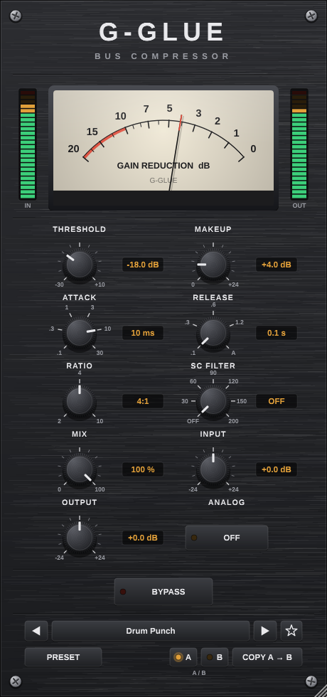

# G-GLUE Bus Compressor

An original stereo bus compressor: linked VCA-style gain with a soft knee, sidechain high-pass, AUTO
(programme-dependent) release, parallel mix, an original analog colour stage, oversampling and output protection.
It comes with a hardware-style GUI, 65 factory presets, a user preset library and A/B comparison.

## Status
| Target | Status |
|---|---|
| Shared DSP / parameters / presets | **built and tested** (x86_64, and armv7 under QEMU) |
| Desktop VST3, Linux x86_64 | **built and tested** in a plugin host |
| Desktop VST2, Linux x86_64 (FST header) | **built and tested** in a plugin host |
| Standalone app, Linux | **built** (not separately tested) |
| VST3 (+ AU) for Windows / macOS: what MPC Desktop and Controller Mode need | CMake + CI workflow ready, **not built here** (no Windows / macOS toolchain; CI push blocked) |
| VST2 for Windows / macOS | not built: needs a VST2 SDK licence (Steinberg) or the GPL FST header |
| **Native MPC Standalone plugin** | **not possible: no public Akai / inMusic plugin SDK.** The engine is ready behind a C bridge built for armv7. See [MPC_STANDALONE_STATUS.md](Documentation/MPC_STANDALONE_STATUS.md) |

## Layout
| Folder | Contents |
|---|---|
| `DSP/` | engine, half-band oversampling, filters, denormal guard: no framework |
| `Parameters/` | the 11 parameters: stable IDs, ranges, MPC-friendly display text |
| `Presets/` | 65 factory presets, `.gglue` user library, favourites, search, state with A/B, preset exporter |
| `GUI/` | look and feel (knobs, screws, brushed plate), analog GR meter, LED meters, needle ballistics |
| `Desktop/` | JUCE processor and editor (VST3 / VST2 / AU / standalone) |
| `VST2/`, `VST3/` | format notes; `VST2/PatchFst.cmake` (FST ABI fix) |
| `MPCStandalone/` | C bridge for a future native MPC wrapper, ARM Makefile, C test |
| `Resources/` | `GUI/` screenshots rendered from the real editor; `FactoryPresets/` as `.gglue` files + index |
| `Tests/` | DSP tests, plugin host test (loads the built binaries), screenshot tool |
| `Documentation/` | [BUILD](Documentation/BUILD.md), [INSTALL + MPC setup](Documentation/INSTALL.md), [architecture](Documentation/ARCHITECTURE.md), [test results](Documentation/TEST_RESULTS.md), [MPC Standalone status](Documentation/MPC_STANDALONE_STATUS.md) |

## Quick start
    cmake -S G-Glue -B build -DCMAKE_BUILD_TYPE=Release [-DGGLUE_VST2_SDK_DIR=/usr/include]
    cmake --build build --parallel
    xvfb-run -a ctest --test-dir build --output-on-failure
    make -C G-Glue/MPCStandalone test        # ARM build of the engine + bridge, tests under QEMU

## Controls
THRESHOLD (−30…+10 dB) · MAKEUP (0…+24 dB) · ATTACK (0.1 / 0.3 / 1 / 3 / 10 / 30 ms) · RELEASE (0.1 / 0.3 / 0.6 / 1.2 s,
AUTO) · RATIO (2:1, 4:1, 10:1) · SC FILTER (OFF, 30–200 Hz) · MIX (0–100 %) · INPUT / OUTPUT (±24 dB) · ANALOG · BYPASS.
Preset bar: ◀ / ▶, preset menu (categories, favourites, search), ★ favourite, PRESET menu (Save, Save As, Rename,
Delete, Import, Export), A / B and copy. Double-click a knob to reset it. The window is resizable from 70 % to 200 %.

## Preset categories (65 presets)
MIX BUS 6 · DRUM BUS 6 · HIP-HOP 6 · MASTERING 5 · VOCALS 5 · ROCK 5 · POP 5 · ELECTRONIC 5 · PARALLEL 6 · GENTLE 5 ·
AGGRESSIVE 5 · CREATIVE 6. The full list with settings is in
[Resources/FactoryPresets/FactoryPresets.md](Resources/FactoryPresets/FactoryPresets.md).

G-Glue's name, design, DSP and presets are original. It contains no Waves or SSL artwork, branding, algorithms or
preset names.
