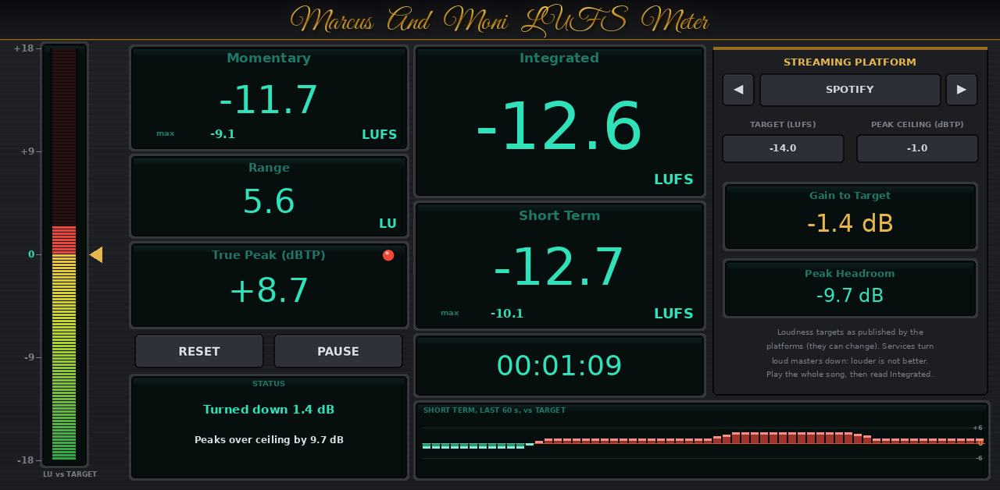

# RadioReady LUFS Meter for MPC

A loudness meter for first-generation MPC OS devices (MPC X, Live / Live II, One, Key 61, Force; 32-bit ARM), built as
a native VST2 insert. It uses the same dependency-free build, packaging and skin pipeline as GlueBus, SP1200, ASR10,
EQ7 and RadioReady EQ. Audio passes through untouched.



- **Measurement** follows ITU-R BS.1770-4 / EBU R128, verified against EBU Tech 3341 / 3342 style test signals:
  - Momentary (400 ms) and Short Term (3 s), each with a maximum
  - gated Integrated
  - Loudness Range (LRA)
  - True Peak in dBTP (4x oversampled at 44.1/48 kHz)
  - elapsed time, with Reset and Pause
- **Platform presets:** Spotify, Spotify Loud, Apple Music, YouTube, Amazon Music, Tidal, Deezer, SoundCloud,
  TikTok / Reels, Apple Podcasts, Spotify Podcasts, EBU R128, ATSC A/85, CD / Club, and Custom. Each sets a target and a
  true-peak ceiling.
- **Status lines** say what the platform will do ("Turned down 2.3 dB", "Plays 1.5 dB quieter", "Peaks over ceiling
  by 0.6 dB"). There are also Gain to Target and Peak Headroom readouts.
- **LED bar** relative to the target, and a 60-second short-term history.

Install and usage: [mpc/INSTALL.md](mpc/INSTALL.md). Design notes: [docs/DESIGN.md](docs/DESIGN.md).

## Build
```
make test                  # native build + offline VST2 host test
make arm                   # build/arm/radioready_lufs.so (needs g++-arm-linux-gnueabihf), or: make docker
./scripts/package.sh       # dist/RadioReadyLUFS-1.0.0-mpc-armv7.zip
./scripts/deploy.sh <ip>   # copy + install over SSH
python3 tools/make_skin.py docs   # regenerate the skin (+ preview rendered from build/native)
```
