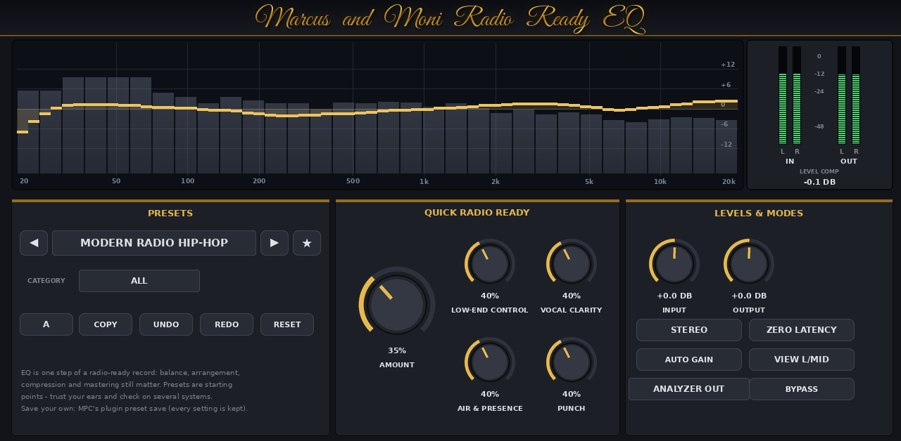
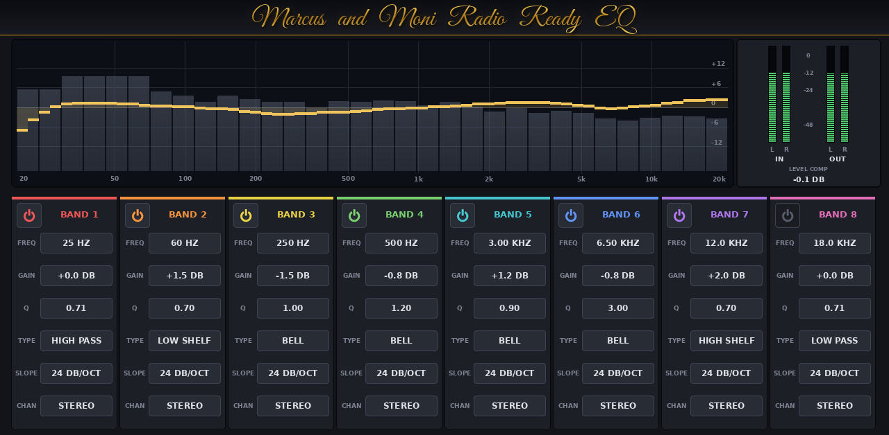

# RadioReady EQ for MPC

A professional 8-band EQ with a QUICK RADIO READY section, a live analyzer, an EQ curve, meters and 55 presets. It's a
native VST2 insert effect for first-generation MPC OS devices (MPC X, Live / Live II, One, Key 61, Force; 32-bit ARM)
and uses the same dependency-free build, packaging and skin pipeline as GlueBus, SP1200, ASR10 and EQ7.




- **8 bands**, each with:
  - type: Bell, Low/High Shelf, High/Low Pass (12/24/48 dB/oct), Notch or Band Pass
  - range: 20 Hz–20 kHz, ±18 dB, Q 0.1–10
  - channel: Stereo, Left/Mid or Right/Side
- **Processing:**
  - 64-bit filters
  - click-free: parameters glide, and type/slope/routing changes crossfade
  - a flat EQ is bit-transparent
- **QUICK RADIO READY:** Amount (0% = no effect), Low-End Control, Vocal Clarity, Air & Presence and Punch. The boost
  is capped at +4 dB and the section is level-matched.
- **Levels and modes:** input/output gain, Auto Gain, Stereo or Mid/Side, and Zero Latency or HQ 2x oversampling
  (31 samples of latency).
- **Presets and editing:**
  - presets: Init plus 50 in 5 categories, plus 5 translation presets, all gain-staged
  - browsing: category filter, favourites, prev/next
  - editing: A/B with copy, undo/redo, reset
  - your own presets are saved through MPC's plugin preset save
- **Display:** a 64-point curve, a 32-band analyzer (in or out), in/out peak meters and a level-comp readout.
- Works at every sample rate from 44.1 to 192 kHz.

Install and usage: [mpc/INSTALL.md](mpc/INSTALL.md). Design notes: [docs/DESIGN.md](docs/DESIGN.md).

## Build
```
make test        # native build + offline VST2 host test (no MPC needed)
make arm         # build/arm/radioready.so (needs g++-arm-linux-gnueabihf), or: make docker
./scripts/package.sh                 # dist/RadioReady-1.0.1-mpc-armv7.zip (ARM/glibc checks, skin, installer)
./scripts/deploy.sh <mpc-ip>         # copy + install over SSH
python3 tools/make_skin.py docs      # regenerate the skin (+ previews rendered from build/native)
make presets                         # presets/factory.json -> src/presets.inc (with gain staging)
```

## Layout
- `src/Biquad.h`, `src/EQEngine.*`: the DSP engine (framework-free).
- `src/Oversampler.h`: 63-tap halfband FIR for HQ 2x.
- `src/radioready.cpp`: the VST2 plugin, covering parameters, presets, A/B, undo, display and meters.
- `presets/factory.json`: editable presets. `tools/gen_presets.py` compiles them into `src/presets.inc`.
- `mpc/`: installer, uninstaller, plugin list entry and skin. `scripts/`: package and deploy.
- `test/host_test.cpp`: dlopen host test covering filters, routing, Quick section, presets, A/B, undo, sample rates
  and HQ.

The plugin is VST2 only. MPC OS doesn't load VST3 or AU plugins, and a desktop version isn't part of this package.
